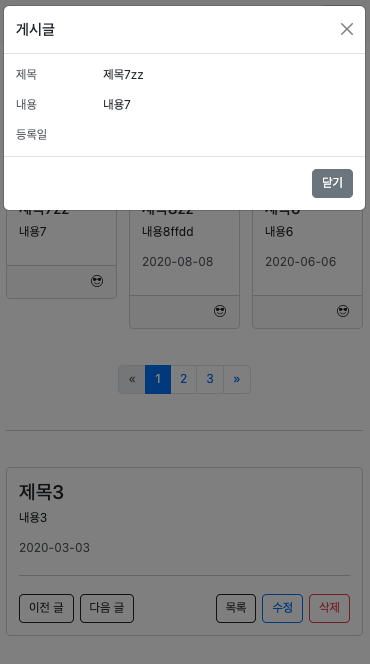

### Transition

> vue 에서는 `transition` 이나 `Animations` 를 쉽게 조작 할 수 있도록 내장된 컴포넌트를 제공

- `<Transition>` : 컴포턴트가 DOM 에 나타나고 사라질 때 애니메이션을 적용하기 위해 사용하는 컴포넌트
- `<TransitionGroup>` : 컴포넌트가 `v-for` 목록에 삽입, 제거 또는 이동할 때 애니메이션을 적용하기 위해 사용하는 컴포넌트

<br/>

#### Transition Component

> `default slot` 을 통해 전달 된 컴포넌트가 나타나거나 (enter) 사라질 때 (leave) 애니메이션을 적용하는데 사용

입장(enter) 퇴장(leave) 는 다음 중 하나에 의해 트리거 될 수 있음

- `v-if` 를 통한 조건부 렌더링
- `v-show` 를 통한 조건부 표시
- `<component>` 라는 특수한 엘리먼트를 통한 동적 컴포넌트 Toggle

```vue
<template>
  <button @click="show = !show">Toggle</button>
  <Transition>
    <p v-if="show">hello</p>
  </Transition>
</template>
```

<br/>

#### Teleport

> vue 에서 제공하는 내장 기술로 하위 컴포넌트를 특정 위치로 재위치 시켜주는 역할을 함

1. `modal` 을 만들때 주로 사용함
2. 이동할 곳을 `to` props 에 작성

```vue
<template>
  <teleport to="#modal">
    <Modal />
  </teleport>
</template>
```

```html
<body>
  <div id="app"></div>
  <div id="modal"></div>
  <script type="module" src="/src/main.js"></script>
</body>
```



[<< 이전 페이지로 돌아가기](../../README.md)
