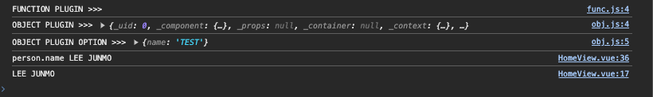

### 플러그인이란?

> 플러그인은 일반적으로 전역수준의 기능을 추가할 때 사용하는 기능을 말함

하지만 **엄격하게** 정의된 범위는 **없다**

일반적인 플러그인이 유용한 시나리오는 다음과 같다.

1. `app.component()` 메서드를 사용하여 전역 컴포넌트를 등록하고자 할 때
2. `app.directive()` 메서드를 사용하여 커스텀 디렉티브를 등록하고자 할 때
3. `app.provide()` 를 사용하여 앱 전체에 리소스 (메서드 또는 데이터) 를 주입할 때
4. 전역 애플리케이션 인스턴스에 속성 또는 메서드를 추가하고자 할 때 `app.config.globalProperties` 에 연결하여 추가할 수 있음
5. 상단의 몇가지 조합을 수행하는 라이브러리를 설치하고자 할 때 (ex. vue-router)

<br/>

#### 플러그인 작성하기

> 플러그인은 `install()` 메서드를 갖고있는 객체나 단순히 설치 함수로 만들 수 있음

```javascript
//install() method 를 갖고 있는 객체
const objPlugin = {
  install(app, options) {}
}

// 단순히 설치 함수
function funcPlugin(app, options) {}
```

> 그리고 작성한 플러그인을 전역수준의 기능으로 추가할 때는 `app.use()` method 를 사용할 수 있음

```javascript
import { createApp } from 'vue'
import router from '@/router'
import { funcPlugin } from './plugins/func'
import { objPlugin } from './plugins/obj'

const app = createApp(App)
app.use(router)
app.use(funcPlugin /*, { options }*/)
app.use(objPlugin /*, { options }*/)
```

#### 작성 예시

```javascript
// plugins/person.js

export default {
  install(app, options) {
    const person = {
      name: 'LEE JUNMO',
      say() {
        alert(this.name)
      },
      ...options
    }
    app.config.globalProperties.$person = person
    app.provide(`person`, person)
  }
}
```

```javascript
createApp(App)
  .use(funcPlugins)
  .use(objPlugins, { name: 'TEST' })
  .use(person)
  .use(router)
  .mount('#app')
```

```vue
<template>
  <div>
    <h2>HOME VIEW</h2>
    <button class="btn btn-primary" @click="goAboutPage">ABOUT 으로 이동</button>
    <hr class="my-4" />
    <app-grid :items="items" v-slot="{ item }" col-class="col-3">
      <app-card>{{ item }}</app-card>
    </app-grid>
    <hr class="my-4" />
    <h2>{{ $person.name }}</h2>
    <button @click="person.say">CLICK PERSON</button>
  </div>
</template>

<script>
export default {
  created() {
    console.log(this.$person.name)
  }
}
</script>

<script setup>
import { useRouter } from 'vue-router'
import AppCard from '@/components/AppCard.vue'
import AppGrid from '@/components/AppGrid.vue'
import { inject, ref } from 'vue'

const router = useRouter()

const goAboutPage = () => {
  router.push('/about')
}

const items = ref(['사과', '딸기', '포도', '바나나'])
const person = inject('person')
console.log(`person.name`, person.name)
</script>

<style lang="scss" scoped></style>
```



<br/>

[<< 이전 페이지로 돌아가기](../../README.md)
