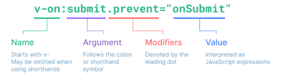

## 디렉티브 (Directive)

디렉티브는 `v-` 접두사가 있는 특수 속성

기능상에서 중요한 역할인 컴포넌트(DOM 요소) 에게 **~~하게 작동하라** 라고 지시를 하는 지시문

- `v-text`
- `v-html`
- `v-show`
- `v-if`
- `v-else`
- `v-else-if`
- `v-for`
- `v-on` = `@`
- `v-bind` = `:`
- `v-model`
- `v-slot` = `#`
- `v-pre`
- `v-once`
- `v-cloak`
- `v-memo`

<br/>

### 디렉티브 구성

- Directive : `v-` 접두사가 있는 특수속성으로 디렉티브의 값이 변경될 때 특정 효과를 반응적으로 DOM 에 적용하는 것을 말함
- Argument : 일부 디렉티브는 디렉티브 명 뒤에 `:` 으로 붙는 전달인자를 가질 수 있음
  - Dynamic Argument : 대괄호를 사용하여 전달인자를 동적으로 삽입
- modifiers : 수식어는 `.` 으로 표시 되는 특수 접미사로 디렉티브가 특별한 방식으로 바인딩 되어야 함을 알림



### 커스텀 디렉티브

> Vue Core 에서 기본으로 제공하는 directive (v-if , v-for ...) 외에도 직접 커스텀하여 사용 할 수 있음

Vue 에서는 `Component` 와 `Composables` 두 가지 형태의 코드 재사용을 도입

- `Component` : 주요 빌딩블록을 재사용
- `Composable` : stateful logic 을 재사용

<br/>

#### script setup directive

> `<script setup>` 에서의 `v` 접두사로 시작하는 모든 camelCase 변수를 custom-directive 로 사용할 수 있음

```vue
<script setup>
// enables v-focus in templates
const vFocus = {
    mounted: (element) => element.focus();
}
</script>

<template>
  <input v-focus />
</template>
```

페이지 로드 뿐만 아니라 동적으로 요소를 삽입할 때도 작동하기 때문에 `auto-focus` 속성보다 더 유용함

<br/>

#### Directives Hooks

> 디렉티브 정의 객체는 다음과 같은 여러 훅을 사용할 수 있습니다.

```javascript
const myDirective = {
  // 바인딩된 요소의 속성 전에 호출 됨
  // 또는 이벤트 리스너가 적용 됨
  created(element, binding, vnode, prevVnode) {
    // 인수에 대한 자세한 내용은 아래를 참조
  },
  // 요소가 DOM 에 삽입되기 직전에 호출
  beforeMount() {
    // 바인딩 된 요소의 부모 구성 요소가 있을 때 호출 됩니다.
    // 모든 자식이 마운트 됩니다.
  },
  mounted() {
    // 상위 컴포넌트가 업데이트되기 전에 호출 됨
  },
  beforeUpdate() {
    // 상위 컴포넌트 다음에 호출되고 모든 자식이 업데이트
  },
  updated() {
    // 상위 컴포넌트가 마운트 해제되기 전에 호출 됨
  },
  beforeUnmount() {
    //  상위 컴포넌트가 마운트 해제될 대 호출됩니다.
  },
  unmounted() {}
}
```

- `element` : 디렉티브가 바인딩 된 요소, DOM 을 직접 조작하는 데 사용할 수 있음
- `binding` : 다음 속성을 포함하는 객체
  - `value` : 지시문에 전달된 값
  - `oldValue` : `beforeUpdate` 및 업데이트에서만 사용할 수 있는 이전 값
  - `arg` : 지시문에 전달된 인수 ex) `v-my-directive:foo` 에서의 `foo`
  - `modifiers` : 수정자가 있는 경우 수정자를 포함하는 개체 `v-my-directive.foo.bar` 에서의 `{foo: true, bar: true}`
  - `instance` : 지시문이 사용되는 구성 요소의 인스턴스
  - `dir` : 지시문 정의 객체
- `vnode` : 바인딩 된 요소를 나타내는 기본 VNode
- `prevNode` : 이전 렌더링에서 바인딩된 요소를 나타내는 VNode. `beforeUpdate` 및 `updated` 후크에서만 사용할 수 있음

<br/>

#### 컴포넌트에서 커스텀 디렉티브 사용

> 커스텀 디렉티브가 컴포넌트에서 사용되면 Non-Props 속성과 유사ㅏ게 항상 컴포넌트의 루트노드에 적용 됨

컴포넌트에는 잠재적으로 둘 이상의 루트노드가 있을 수 있음

다중 루트 컴포넌트에 커스텀 디렉티브를 적용하면 디렉티브가 무시가 되고 경고가 발생하는데, **속성과 달리 디렉티브**는 `v-bind=$attrs` 를 사용하여 다른 요소에 전달할 수 없음

**일반적으로 컴포넌트에 사용자 지정 지시문을 사용하는 것은 권장되지 않음**

<br/>

[<< 이전 페이지로 돌아가기](../../README.md)
