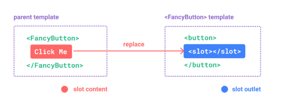

## Slots

> HTML 요소와 마찬가지로 우리가 만든 컴포넌트에 콘텐츠를 전달할 수 있으면 유용

```vue
<!-- FancyButton.vue -->
<template>
  <button class="fancy-btn">
    <slot></slot>
  </button>
</template>
```

부모컴포넌트

```vue
<template>
  <FancyButton>
    <!-- 슬롯 컨텐츠 -->
    Click !!
  </FancyButton>
</template>
```

`<slot></slot>` 요소는 **부모 컴포넌트에서 제공하는 콘텐츠를 나타내는 슬롯 컨텐츠**.

또한 슬롯은 텍스트 뿐만 아니라 HTML, 컴포넌트등 다양한 모든 콘텐츠가 될 수 있음

```vue
<template>
  <FancyButton>
    <!-- 슬롯 컨텐츠 -->
    <span style="color: red">Click me</span>
    <i>!</i>
  </FancyButton>
</template>
```



<br/>

### Fallback Content

상위 컴포넌트에서 슬롯 콘텐츠가 제공되지 않았을 때 슬롯에 대한 fallback(기본 콘텐츠) 를 지정할 수 있음

```vue
<!-- FancyButton.vue -->
<template>
  <button class="btn">
    <slot>Default Click!!!</slot>
  </button>
</template>
```

<br/>

### Named Slots

`<slot>` 요소에 이름을 부여하여 여러개의 `<slot>` 을 정의 할 수 있음

```vue
<!-- BaseCard.vue -->
<template>
  <article>
    <div>
      <slot name="header"></slot>
    </div>
    <div>
      <slot></slot>
    </div>
    <div>
      <slot name="footer"></slot>
    </div>
  </article>
</template>
```

- `<slot>` 에 `name` 속성을 부여하여 특정 슬롯 콘텐츠가 렌더링 되어야 할 위치를 설정할 수 있음
- `name` 이 없는 `<slot>` 의 이름은 암시적으로 `default` 임

```vue
<!-- 부모 컴포넌트 사용 예시 -->
<template>
  <BaseCard>
    <template v-slot:header>제목</template>
    <template v-slot:default>안녕하세요</template>
    <template v-slot:footer>하단</template>
  </BaseCard>
</template>
```

위 예시 처럼 `name` 이 부여 된 `<slot>` 에 콘텐츠를 전달하려면 `v-slot` 디렉티브를 사용항여 전달할 수 있음

`v-slot:args` 를 사용하여 지정한 슬롯 콘텐츠에 전달할 수 있음

`v-slot` 은 단축키 `#` 로 표현할 수 있음

```vue
<!-- 부모 컴포넌트 사용 예시 -->
<template>
  <BaseCard>
    <template #header>제목</template>
    <template #default>안녕하세요</template>
    <template #footer>하단</template>
  </BaseCard>
</template>
```

암시적으로도 처리 가능

```vue
<!-- 부모 컴포넌트 사용 예시 -->
<template>
  <BaseCard>
    <template #header>제목</template>
    <!-- 암시적으로 Default -->
    안녕하세요
    <template #footer>하단</template>
  </BaseCard>
</template>
```

<br/>

### Dynamic Slot Named

`v-slot` 디렉티브 전달인자에 데이터를 바인딩하여 동적으로 변경할 수도 있음

```vue
<template>
  <BaseCard>
    <template v-slot:[dynamicSlotName]> ... </template>
  </BaseCard>

  <!-- with shorthand -->
  <template #[dynamicSlotName]> ... </template>
</template>
```

<br/>

### Render Scope

슬롯 콘텐츠는 상위 컴포넌트에 정의되어 있으므로 상위 컴포넌트의 데이터 영역에 접근은 가능하지만 _하위 컴포넌트의 영역에는 접근할 수 없음_

<br/>

### Scoped Slots

Render Scope 에서 언급했던 것 처럼 슬롯 콘텐츠는 자식 컴포넌트의 데이터에 접근할 수 없음

하지만 슬롯 컨텐츠에서 상위 컴포넌트와 함위 컴포넌트 데이터를 모두 사용할 수 있다면 개발할때 매우 유용

이런 방법으로 자식 컴포넌트에서 `<slot>` 요소를 사용할 때 props 를 전달하는 것 처럼 속성을 슬롯 콘텐츠에 전달할 수 있음

```vue
<!-- MyComponent.vue -->
<template>
  <div>
    <slot :text="greetingMessage" :count="count"></slot>
  </div>
</template>
<script>
import { ref } from 'vue'

export default {
  setup() {
    const greetingMessage = ref('Hello World!')
    const count = ref(1)
    return {
      greetingMessage,
      count
    }
  }
}
</script>
```

`default` `<slot>` 이 하나 밖에 없는 경우에는 `v-slot` 디렉티브를 이용하여 props 를 전달 받을 수 있음

```vue
<template>
  <MyComponent v-slot="slotProps"> {{ slotProps.text }} {{ slotProps.count }} </MyComponent>
</template>
```

구조분해할당 문법으로 더 사용하기 편리하게 받을 수 있음

```vue
<template>
  <MyComponent v-slot="{ text, count }"> {{ text }} {{ count }} </MyComponent>
</template>
```

<br/>

### Named Scoped Slots

이름이 부여된 슬롯도 유사하게 작동

```vue
<template>
  <MyComponent>
    <template #header="headerProps">
      {{ headerProps }}
    </template>

    <template #default="defaultProps">
      {{ defaultProps }}
    </template>

    <template #footer="footerProps">
      {{ footerProps }}
    </template>
  </MyComponent>
</template>
```
