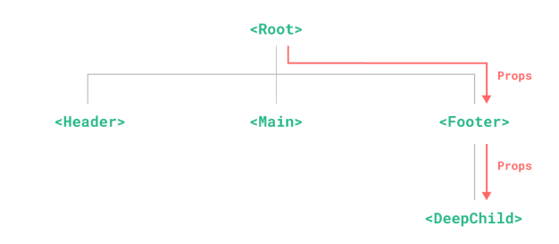
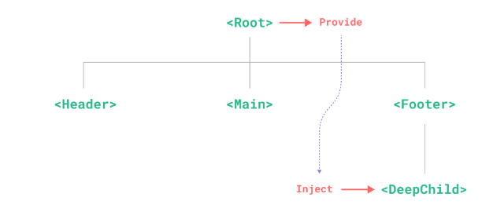

## Provide / Inject

### Props Drilling

일반적인 부모컴포넌트에서 자식 컴포넌트로 데이터를 전달해야 할 때 props 를 사용함

하지만 규모가 큰 컴포넌트 트리가 있고 깊이 중첩된 자손 컴포넌트에 데이터를 전달해야 한다면

해당 자손 컴포넌트와 연관된 모든 자식 컴포넌트에게 동일한 props 를 전달해야 함



`<Root/>` 에서 `<DeepChild>` 컴포넌트에 데이터를 전달하기 위해서는 `<Footer/>` 컴포넌트를 거쳐 데이터를 전달해야 함

만약 더 긴 상위 체인이 있으면 더 많은 상위 컴포넌트들이 영향을 받음. 이것을 **props-drilling** 이라고 함

<br/>

**Props Drilling** 문제는 vue3 의 `provide` 와 `inject` 로 해결할 수 있음

`provide` 와 `inject` 를 사용하면 데이터를 제공하는 상위 컴포넌트는 **dependency provider** 역할을 함 그리고

데이터를 받는 하위 컴포넌트는 깊이에 관게 없이 **dependency provider** 가 제공하는 종속성(data, function 등)을 주입받을 수 있음



<br/>

### Provide

하위 컴포넌트 항목에 데이터를 제공하려면 **provider** 역할을 하는 상위 컴포넌트 `setup()` 함수 내부에 있음

```javascript
import { provide } from 'vue'

export default {
  setup() {
    provide('message', 'hello!')
  }
}
```

`provide()` 함수는 두 개의 파라미터를 받음

- 첫 번째 **주입 키** : 문자열 또는 symbol 이 될 수 있음. 주입 키는 하위 컴포넌트에서 주입된 값을 조회하는데 사용 됨
- 두 번째 **제공된 값** : 값은 refs 와 같은 반응성 데이터를 포함하여 모든 유형이 있음

```javascript
import { provide, ref } from 'vue'

export default {
  setup() {
    const message = ref('Hello World!')
    provide('message', message)
    return {
      message
    }
  }
}
```

반응성 데이터를 사용하면 제공된 값을 사용하는 하위 컴포넌트가 공급자 컴포넌트에 대한 반응 연결을 설정할 수 있음

<br/>

### Inject

상위 컴포넌트에서 제공한 데이터를 삽입하려면 하위 컴포넌트 `setup()` 함수 내부에서 `inject()` 함수를 사용할 수 있음

```javascript
import { inject } from 'vue'
export default {
  setup() {
    const message = inject('message')
    const appMessage = inject('appMessage')
    return {
      message,
      appMessage
    }
  }
}
```

주입된 값이 ref이면 반응성 연결을 유지할 수 있음

<br/>

#### Inject 기본값

만약 `inject` 로 주입된 키가 상위 체인 어디에서든 제공되지 않을 경우 런타임 경고가 표시 됨

이때 두 번째 인자로 기본 값 (Default Value) 를 설정할 수 있음

```vue
<script>
const defaultMessage = inject('defaultMessage', 'default message')

// 팩토리 함수도 제공할 수 있음
const defaultMessage = inject('defaultMessage', () => 'default message')
</script>
```

<br/>

### Reactivity

Provide/Inject 를 반응성 데이터로 제공할 때 **가능한 모든 변경을 Provider 내부에서 하는 것이 좋음**

이렇게 Provider 내부에 배치되면 향후 유지관리가 용이함

만약 injector 내부 컴포넌트에서 반응성 데이터를 변경해야 하는 경우 데이터 변경을 제공하는 함수를 함께 제공하는 것이 좋음

```vue
<script>
// Provider
const message = ref('Hello World!')
const updateMessage = () => {
  message.value = 'world!'
}
provide('message', { message, updateMessage })

// Injector
const { message, updateMessage } = inject('message')

import { provide, readonly, ref } from 'vue'

// 주입된 컴포넌트에서 제공된 값을 변경할 수 없도록 하려면 readonly 함수를 사용
provide('count', readonly(count))
</script>
```

<br/>

### Symbol 키 사용

대규모 애플리케이션에서 다른 개발자와 함께 작업할 때 잠재적 충돌을 피하기 위해 Symbol 주입키를 사용하는 것이 가장 좋음

```vue
<script>
// keys.js
export const myInjectionKey = Symbol()

// in provider component
import { provide } from 'vue'
import { myInjectionKey } from './keys.js'

provide(myInjectionKey, {
  /* data to provide */
})

// in injector component
import { inject } from 'vue'
import { myInjectionKey } from './keys.js'

const injected = inject(myInjectionKey)
</script>
```

<br/>

### App-Level Provide

컴포넌트에서 데이터를 제공하는 것 외에도 App-Level 에서 제공할 수도 있음

```javascript
import { createApp } from 'vue'
import App from './App.vue'
const app = createApp(App)
app.provide('appMessage', 'Hello app message')
app.mount('#app')
```

#### Provide/Inject 사용 예

App-Level 에서 Provide 는 앱에서 렌더링 되는 모든 컴포넌트에서 사용할 수 있음

특히 Plugin 을 사용할 때 유용

Vue2 에서 컴포넌트 인스턴스 객체를 추가할 때 global property 에 추가했으나 Vue3 에서 Composition API Setup 함수에서는 컴포넌트 인스턴스에 접근할 수 없음

이때 대신 Provide/Inject 를 사용할 수 있음
