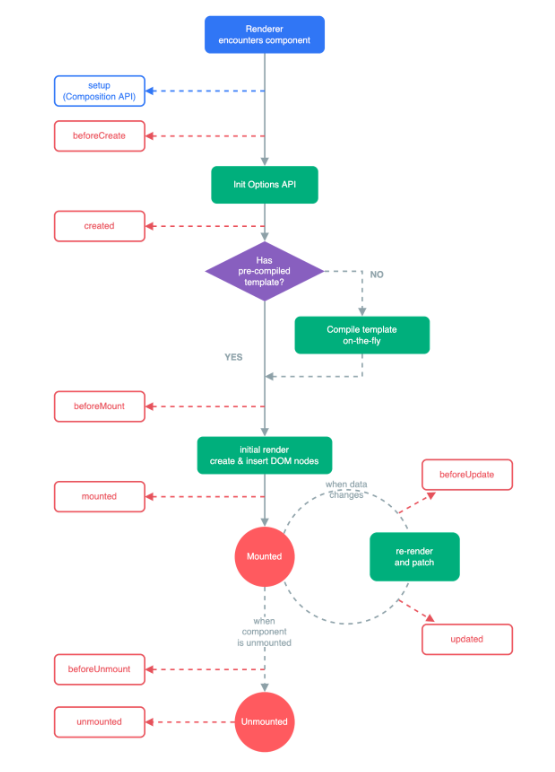

## Life-Cycle Hooks

> 각각의 Vue 컴포넌트 인스턴스는 생성되고 소멸될 때 사전에 정의된 몇 단계의 과정을 거치게 되는데
>
> 이를 라이프 사이클 (생명주기, Life Cycle) 이라고 함

`Life-Cycle Hooks` 는 생명주기 단계에서 사용자가 자신의 코드를 추가 할 수 있는 단계별 기능을 일컬음

<br/>

### Life-Cycle 다이어그램



인스턴스 수명 주기에 대한 다이어그램

<br/>

### Life-Cycle Hooks 등록

컴포넌트가 랜더링을 완료하고 DOM 노드를 만든 후 `onMounted hook` 을 사용하여 코드를 실행

```vue
<script>
import { onMounted } from 'vue'

export default {
  setup() {
    onMounted(() => {
      console.log('컴포넌트 mounted')
    })
  }
}
</script>
```

<br/>

### Life-Cycle Hooks

> 컴포넌트 라이프 사이클 각 단계에서 실행되는 함수를 라이프사이클 훅이라고 함

라이프 사이클 훅에 접두사 `on` 을 붙여 컴포넌트 라이프사이클 훅에서 코드를 실행 할 수 있음

아래 표에 있는 라이프사이클 훅은 `setup()` 함수 내에서 동기적으로 호출해야 함

다음 표에서 여러 라이프사이클 훅 단계와 `setup()` 함수 내에서 호출하는 방법을 확인할 수 있음

| options API       | setup 내부에서 사용 |
| ----------------- | ------------------- |
| `beforeCreate`    | 필요하지 않음\*     |
| `created`         | 필요하지 않음\*     |
| `beforeMount`     | `onBeforeMount`     |
| `mounted`         | `onMounted`         |
| `beforeUpdate`    | `onBeforeUpdate`    |
| `updated`         | `onUpdated`         |
| `beforeUnmount`   | `onBeforeUnmount`   |
| `unmounted`       | `onUnmounted`       |
| `errorCaptured`   | `onErrorCaptured`   |
| `renderTracked`   | `onRenderTracked`   |
| `renderTriggered` | `onRenderTriggered` |
| `activated`       | `onActivated`       |
| `deactivated`     | `onDeactivated`     |
| `serverPrefetch`  | `onServerPrefetch`  |

**Create(생성)** -> **Mounting(장착)** -> **Updating(수정)** -> **Destruction(소멸)**

<br/>

### Creation

컴포넌트 초기화 단계, 라이프사이클 단계에서 가장 먼저 실행 됨

- 아직 컴포넌트가 DOM 에 추가되기 전이므로 DOM 에 접근할 수 없음
- 서버 렌더링에서 지원되는 단계
- 클라이언트나 서버 렌더 단에서 처리해야 할 일이 있으면 이 단게에서 진행

<br/>

#### beforeCreate

컴포넌트 인스턴스가 초기화 될 때 실행 `data()` 또는 `computed` 와 같은 다른 옵션을 처리하기 전에 즉시 호출

<br/>

#### created

컴포넌트 인스턴스가 초기화를 완료한 후 호출되는 Hook

<br/>

#### setup

Composition API 의 `setup()` 훅은 Options API Hook 보다 먼젖 호출 됨

`beforeCreate` 와 `created` 라이프사이클 훅은 Options API 에서 사용할 수 있는 라이프사이클 훅으로

Compsition API 를 활용하여 개발을 진행할 때는 `setup()` 함수로 대체 가능

```vue
<script>
export default {
  beforeCreate() {},
  created() {},
  setup() {}
}
</script>
```

<br/>

### Mounting

DOM 에서 컴포넌트를 삽입하는 단계, `onBeforeMount`, `onMounted` 가 있음

- 서버랜더링에서 지원되지 않음
- 초기 랜더링 직전에 DOM 을 변경하고자 한다면 이 단계에서 활용할 수 있음

<br/>

#### onBeforeMount

컴포넌트가 마운트되기 직전에 호출 됨

- 대부분 사용 권장하지 않음

<br/>

#### onMounted

컴포넌트가 마운트 된 후에 호출되며 DOM 에 접근할 수 있음

- 모든 자식 컴포넌트가 mount 되었음을 의미함
- 자체 DOM 트리가 생성되어 상위 컴포넌트에 삽입되었음을 의미함

<br/>

### Updating

반응형 상태 변경으로 컴포넌트의 DOM 트리가 업데이트 된 후 호출될 콜백을 등록함

- 디버깅이나 프로파일링 등을 위해 컴포넌트 재 랜더링 시점을 알고 싶을 때 사용함

<br/>

#### onBeforeUpdate

반응형 상태 변경으로 컴포넌트의 DOM 트리를 업데이트 하기 직전에 호출될 콜백을 등록함

컴포넌트에서 사용되는 반응형 상태 값이 변해서 DOM 에도 그 변화를 적용시켜야 할 때가 있음

이때 변화 직전에 호출 되는 것이 `onBeforeUpdate hook`

<br/>

#### onUpdated

반응형 상태 변경으로 인해 컴포넌트가 DOM 트리를 업데이트 한 후에 호출 됨

상위 컴포넌트의 `onUpdated` 훅은 하위 컴포넌트의 훅 이후에 호출 됨 (Child -> Parent)

이 훅은 다른 상태 변경으로 인해 발생할 수 있는 컴포넌트의 DOM 업데이트 후에 호출 됨

특정 상태 변경후에 업데이트 된 DOM 에 엑세스해야 하는 경우 대신 `nextTick()` 을 사용

> WARNING
>
> `onMounted` 훅에서 컴포넌트 상태를 변경하면 무한 루프에 걸릴 수 있음

<br/>

### Destruction

해제 단계이며 `onBeforeUnmount` 와 `onUnmounted` 가 있음

<br/>

#### onBeforeUnmount

컴포넌트가 해제되기 직전에 호출 됨

<br/>

#### onUnmounted

컴포넌트가 마운트 해제 된 후 호출

<br/>

#### ETC

- `onErrorCaptured()`
- `onRenderTracked()`
- `onRenderTriggerd()`
- `onActivated()`
- `onDeactivated()`
- `onServerPrefetch()`

<br/>

[<< 이전 페이지로 돌아가기](../../README.md)
