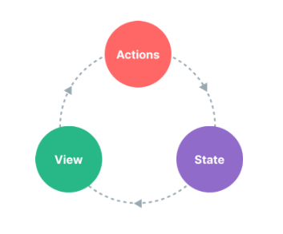

## 상태관리란?

### 상태 관리 패턴이랑?

> 모든 Vue 컴포넌트 인스턴스는 자체적으로 상태를 관리함

```vue
<script setup>
import { ref } from 'vue'

// state
const count = ref(0)

// actions
function increment() {
  count.value++
}
</script>

<!-- view -->
<template>
  {{ count }}
</template>
```

해당 컴포넌트는 다음 부분으로 구성된 하나의 독립된 단위

- state - 컴포넌트 내에 선언된 상태
- view - 상태가 선언적으로 매핑된 템플릿
- actions - view 에서 사용자 입력에 대한 반응으로 state 를 변경할 수 있음



컴포넌트간에 공통된 상태를 공유하려면 ...

- 공유하고자 하는 상태를 같은 부모 컴포넌트를 두고 Props 로 전달
  - _Props Drilling_ 이라는 깊은 계층구조 문제를 가질 수 있음
- Template Refs 를 사용해서 부모/자식 인스턴스에 직접 접근하거나 Emits 이벤트를 통해 여러 복사본 상태 동기화
  - 이러한 패턴은 유지 관리할 수 없는 코드로 이어짐

더 간단한 해결책은 컴포넌트에서 공유 상태를 추출하여 글로벌 싱글톤으로 관리하는 것

이러한 글로벌 공통 상태에 대해 모든 컴포넌트는 View 역할을 하며 컴포넌트 위치에 관계없이 상태에 접근하거나 변경할 수 있음

<br/>

### Reactivity API 를 통한 상태관리

여러 컴포넌트에서 공유해야하는 상태가 있는 경우 `reactive()` 를 사용하여 반응형 객체를 만든 다음 여러 컴포넌트에서 가져올 수 있음

```javascript
import { reactive } from 'vue'

export const store = reactive({
  count: 0
})
```

```vue
<!-- ComponentA.vue -->
<script setup>
import { store } from './store.js'
</script>

<template>
  <div>From A: {{ store.count }}</div>
</template>
```

```vue
<!-- ComponentB.vue -->
<script setup>
import { store } from './store.js'
</script>

<template>
  <div>From B: {{ store.count }}</div>
</template>
```

이제 `store` 객체가 변경 될 때마다 `<ComponentA/>` 와 `<ComponentB/>` 의 View 가 자동으로 업데이트 됨

하지만 이런 코드는 `store` 를 가져오는 모든 컴포넌트가 원하는대로 변경할 수 있음을 의미 함

```vue
<template>
  <button @click="store.count++">Component B: {{ store.count }}</button>
</template>
```

이러한 방법은 로직이 간단하면 문제가 없지만 **컴포넌트에 의해 임의로 변경될 수 있는 전역 상태 관리**는 장기적으로 유지하기 쉽지않음

상태를 변경하는 로직이 상태 자체처럼 중앙 집중화 되도록 하려면 작업의 의도를 나타내는 이름으로 `store` 객체에 메서드를 정의하는 것이 좋음

```javascript
// store.js

import { reactive } from 'vue'

export const store = reactive({
  count: 0,
  increment() {
    this.count++
  }
})
```

```vue
<template>
  <button @click="store.increment()">Component B : {{ store.count }}</button>
</template>
```

> TIP
>
> `@click` 핸들러는 괄호와 함께 메서드를 호출 왜냐하면 increment 메서드는 컴포넌트 메서드가 아니기 때문에 적절한 this 컨텍스트로 메소드를 호출하는데 필요

위 예제에서는 단일 `reactive()` 객체를 저장소로 사용하고 있지만 `ref()` 또는 `computed()` 와 같은 다른 _Reactivity APIs_ 를 사용하여 생산된 반응형 `state` 를 공유하거나 Composable 함수에서 전역상태를 반환할 수도 있음

```vue
<script>
import { ref } from 'vue'

// 모듈 범위에서 생성된 전역 상태
const globalCount = ref(1)

export function useCount() {
  // 컴포넌트 별로 생성된 로컬 상태
  const localCount = ref(1)

  return {
    globalCount,
    localCount
  }
}
</script>
```

이처럼 반응형 상태 관리 시스템이 컴포넌트 모델과 분리되어 있기 때문에 Vue 를 매우 유연하게 사용할 수 있음

<br/>

### Pinia

간단한 애플리케이션에서는 위 예시처럼 수동으로 만든 상태 관리 시스템으로 충분 하지만 대규모 애플리케이션에서는 고려해야 할 사항이 더 많음

- 팀과 협업을 위한 강력한 규칙
- Timeline, in-component, inspection, time-travel debugging 을 포함하는 Vue Devtools 와 통합
- HMR(Hot Module Replacement)
- SSR 지원

Pinia 는 위의 모든 것을 구현하는 상태관리 라이브러리 임 Vue 핵심 팀에서 유지 관리하며 Vue2, Vue3 에서 모두 사용 가능

기존의 사용자들은 공식 관리 라이브러리였던 Vuex 에 익숙할 수 있음 하지만 이제 Vuex 는 이제 유지 관리 모드에 있으며 동작은 하지만 더이상 새기능은 개발하지 안흠. 따라서 Pinia 가 뒤를 계승

Vuex 와 비교를 하면 Pinia 는 더 간단한 API 를 제공하고 Composition API 스타일의 API 를 제공하며 가장 중요한 것은 TypeScript 와 함께 사용할 때 견고한 타입 추론을 지원

<br/>

#### 왜 Pinia 를 사용?

`export const state = reactive()` API 를 활용하여 Global State 를 간단하게 만들 수 있음

하지만 이런 방법은 SPA 기반에서만 해당하는 방법이며 SSR 이 되는 경우 애플리케이션이 보안 취약성에 노출이 됨

또한 SPA 에서도 Pinia 를 사용하면 많은 것을 얻을 수 있음

- Devtools 지원
  - mutations, acions 를 추적하는 타임라인
  - Store 는 사용되는 컴포넌트에 나타남
  - Time Travel 과 더 쉬운 디버깅
- Hot module replacement
  - 페이지 리로딩 store 수정
  - 개발하는 동안 기존 state 유지
- 플러그인 : 플러그인으로 Pinia 기능 확장
- JS 사용자를 위한 적절한 TS 지원 또는 자동완성
- SSR 지원

<br/>

#### Vuex 와 비교를 하자면?

- mutations 이 더이상 존재하지 않음
- TypeScript 를 지원하기 위해 복잡한 사용자 지정 래퍼를 만들 필요가 없음
- 강력한 auto-complecation

<br/>

#### 설치

```
npm install pinia
```

> TIP
>
> 앱이 Vue2 를 사용하는 경우 `@vue/composition-api` 도 설치해야 함

#### 사용 방법

```javascript
//main.js

import { createPinia } from 'pinia'

app.use(createPinia())
```

<br/>

#### Store 란?

Store 는 컴포넌트에 포함되지 않은 state 및 비즈니스 로직을 보유하고 있는 엔터티

전역 상태를 호스팅 하므로 언제 어디서든 사용가능한 전역 컴포넌트와 비슷함

`state`, `getter`, `action` 의 세가지 개념이 있으며 이러한 개념이 `data`, `computed`, `methods` 와 동일하다고 생각함

<br/>

#### 언제 Store 를 이용해야 하는가

Store 에는 애플리케이션 전체에서 접근할 수 있는 데이터가 포함되어야 함

예를 들어 네비게이션에 표시되는 사용자 정보와 같이 여러곳에서 사용되는 데이터가 포함 됨

반면에 컴포넌트에서 관리될 수 있는 로컬 데이터를 Store 에 포함하는 것은 피해야 함

<br/>

[<< 이전 페이지로 돌아가기](../../README.md)
